<p align="center"></p>

One place per machine for ideas, POCs, and long-running AI conversations that outlive a chat but aren't projects yet. Plain markdown in git, with an agent doing the bookkeeping.

- One command: `wb` opens the agent at your workbench; `wb <slug>` opens it on one entry.
- The agent keeps the log and index current. You own the premise and the decisions.
- Readable in five years with no tooling: a directory per entry, a README, a log, a `raw/` folder.



## Install

Requirements: macOS or Linux, bash, git, Node 22.18 or newer, and [Claude Code](https://claude.com/claude-code) or [Codex](https://github.com/openai/codex) on PATH.

```bash
git clone https://github.com/cmgmyr/jig.git ~/Code/jig
cd ~/Code/jig
brew install node@24    # or skip this and pass JIG_NODE below
./install.sh            # pins Node, links wb and wb-* into ~/.local/bin, links the skills
wb init ~/workbench     # scaffold the data repo; or just run `wb` and answer the prompt
wb doctor               # everything green
```

jig pins one Node binary by absolute path so that `wb-new` behaves the same inside a repo that pins Node 18 as it does anywhere else. With Herd, asdf, nvm, or fnm, pass the real binary: `JIG_NODE=/abs/path/to/bin/node ./install.sh`. Never a shim. See [Install details](docs/install.md).

## First run

Run `wb`. The agent reads `INDEX.md`, lists anything in `inbox/`, runs `wb-stale`, and asks what to do. Mention an idea and it runs `wb-new`, then asks you for the premise in one sentence. When you exit, `wb-post` writes a log line for anything you touched, regenerates the index, and commits as `wb(root): session <date>`. Nothing changed, no commit.

Run `wb <slug>` to work on one entry. The agent reads its README and the last ten log lines and tells you where things stand in three sentences.

Run `wb c "some thought"` from anywhere to drop a note in the inbox without opening the agent.

## How it works

The data repo (default `~/workbench`) holds an `AGENTS.md` with a managed block that tells the agent the rules: what it owns, what you own, what to do at the start of a session, and what it must never do (commit, move entries, copy between workbenches). `CLAUDE.md` is a symlink to it, so Claude Code and Codex read the same file. Each entry is `entries/<slug>/` with a `README.md` you own, an append-only `log.md` the agent owns, and `raw/` for sources. `INDEX.md` is generated from frontmatter and `git log`, never hand-edited.

jig itself is a bash launcher, a bash dispatcher, and one TypeScript file per command, run directly by Node with no build step and no dependencies. Two skills, `workbench-new` and `workbench-file`, let you start or file an entry from inside any other repo.

## Why not a notes app or chat history?

| | Chat history | Notes app | jig |
|---|---|---|---|
| Where a decision lives | buried in a transcript | wherever you put it | a dated line in the entry's log |
| What is stale | unknown | unknown | `wb-stale`, from git dates |
| Readable without the tool | no | usually not | yes, it is markdown in git |
| Who does the bookkeeping | nobody | you | the agent, after every session |
| Work and personal | mixed | mixed | one workbench per machine, never synced |

## Status

jig is a personal tool, released low-key. It is single-user by design and used daily by its author on macOS. The test suite also runs on Linux in CI. Issues are welcome; for bigger changes, open one first. See [CONTRIBUTING.md](CONTRIBUTING.md). MIT licensed.

## Docs

| Page | What's there |
|---|---|
| [Commands](docs/commands.md) | `wb` and every `wb-*`: what each does, in what order, and what `wb doctor` checks |
| [Data model](docs/data-model.md) | The layout, entry frontmatter, statuses, the YAML subset, the log, the inbox, the index |
| [Sessions and skills](docs/sessions.md) | The managed block, what happens around a session, two machines, the two skills |
| [Configuration](docs/configuration.md) | `WORKBENCH_HOME`, `WB_AGENT`, agent command overrides |
| [Install details](docs/install.md) | The interpreter pin, Herd, asdf, nvm, fnm, skill links, updating, uninstalling |
| [Troubleshooting](docs/troubleshooting.md) | Every `wb doctor` message and its fix |
| [Development](docs/development.md) | How it runs, the checks, conventions, assets, releasing |
